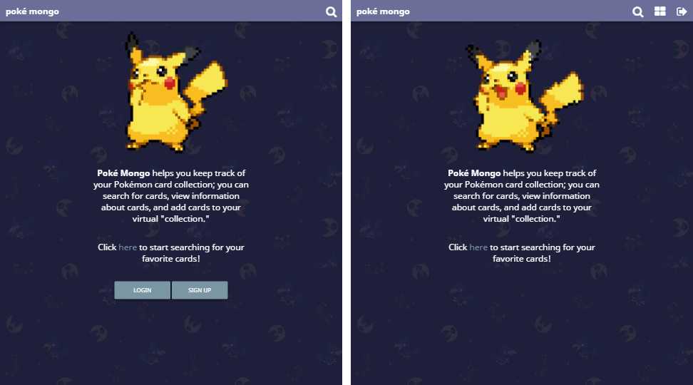
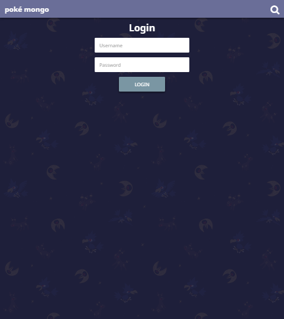
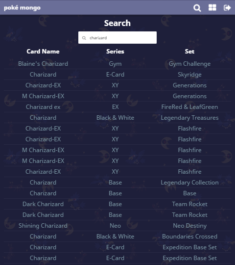
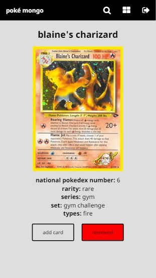

# Pok&eacute; Mongo

## Live Version
https://still-plateau-94668.herokuapp.com/#/

## Summary
Pok&eacute; Mongo is an app for helping people to quickly view and manage their Pok&eacute;mon card collections online. Users sign up for an account, search for cards based on Pok&eacute;mon names, and add the cards which they own to their virtual collection. Users can then view the cards they've added on their collection/profile page.

## Walkthrough

### Home

    

On the home screen, if the user isn't logged in, they're prompted to either login or sign up.

If the user views the home screen after logging in, the login/signup buttons aren't displayed. Also, the navigation bar will now contain the 'collection' and 'logout' icons on every screen, in addition to the 'search' icon.

### Sign up

    

On the sign up screen, the user can create a new account with a username and password. After clicking the 'sign up' button, the user is redirected to the login screen.

### Login

    

On the login screen, the user can login using their registered credentials. After clicking 'login', the user is redirected to their collection page.

### Collection

    

On the collection screen, thumbnails of the cards in the user's collection and the total number of cards collected will display as long as the user has at least one card in their collection. Clicking on a card's thumbnail will redirect the user to that card's info page.

If the user doesn't have any cards in their collection, a message will display which prompts the user to search for cards to add.

### Search

    

On the search screen, the user can search for Pok&eacute;mon cards based on the names of Pok&eacute;mon. The search results populate below the search bar and contain a list of all cards which contain the searched Pok&eacute;mon's name. If the user clicks on the text of a card, they will be redirected to the card info page for that specific card.

### Card Info

    

On the card info screen, the user can see extra information about a specific card, such as Pok&eacute;dex number, rarity, which series it belongs to, etc. If the user is logged in, they have the option of adding or removing the card from their collection by clicking the 'add card' or 'remove card' buttons.

If the user isn't logged in, the 'add card' and 'remove card' buttons will be replaced with a prompt asking the user to login or sign up to use those features.

    
    

After the user clicks 'add card', that button's text will change to 'added' and its background color will change to green to notify the user that the card was added.

Similarly, if the user clicks 'remove card', that button's text will change to 'removed' and its background color will change to red to notify the user that the card was removed.

## Technology Used
* JavaScript (ES6 where possible)
* AngularJS
* Angular-route
* Angular-messages
* HTML5
* CSS3
* LESS
* Node.js
* Express
* MongoDB
* Mongoose
* Passport
* Babel
* Webpack
* Mocha
* Chai
* Travis CI
* NPM
* [Pok&eacute;mon TCG API](https://pokemontcg.io/)
* Font Awesome

## Future Plans
* A wish list for users to keep track of which cards they want but don't already own
* Search filtering (filter by series, rarity, etc.)
* Public profiles where users can view other users' collections/wish lists
* Leaderboards showing which users have collected the most cards based on certain criteria (overall, sets, etc.)
